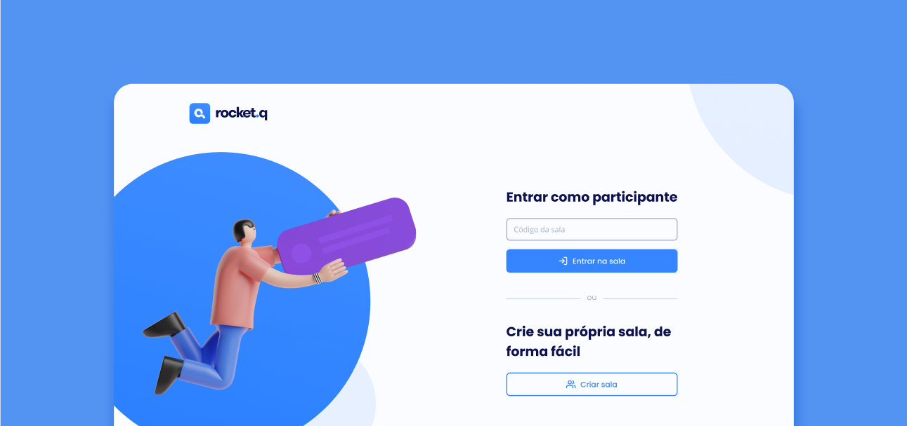

<h1 align="center">
  
</h1>

  <a href="#-tecnologias">Tecnologias</a>&nbsp;&nbsp;&nbsp;|&nbsp;&nbsp;&nbsp;
  <a href="#-projeto">Projeto</a>&nbsp;&nbsp;&nbsp;|&nbsp;&nbsp;&nbsp;
  <a href="#-layout">Layout</a>&nbsp;&nbsp;&nbsp;|&nbsp;&nbsp;&nbsp;
  <a href="#memo-licença">Licença</a>

 

  

 

  

## 🚀 Tecnologias

Este projeto foi desenvolvido com as seguintes tecnologias:

- HTML
- CSS
- JavaScript
- NodeJS
- EJS
- Express
- SQLite

## 💻 Projeto

O Rocket.Q é uma aplicação desenvolvida em parceria com a [Rocketseat](https://rocketseat.com.br) de interação através de perguntas, sendo possível criar uma sala para internautas anônimos fazerem perguntas. O criador da sala  tem o poder de gerenciar essas perguntas (através de uma autenticação por senha), marcando as perguntas como lidas ou excluindo as mesmas.

## 🔖 Layout

Você pode visualizar o layout do projeto através [desse link](https://www.figma.com/file/ShlQVmFzTp8InCeZapen4d/Roquet.Q). É necessário ter conta no [Figma](https://figma.com) para acessá-lo.

## :memo: Licença

Este projeto está sob a licença MIT. Veja o arquivo [LICENSE](.github/LICENSE) para mais detalhes.